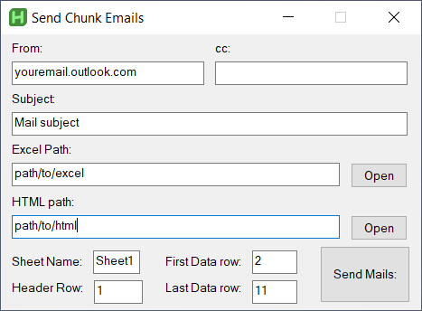

<a id="readme-top"></a>

<!-- PROJECT LOGO -->
<br />
<div align="center">

<h3 align="center" style="font-size:30px">Send Chunk Email</h3>
  <p align="center">
    Send Chunk Email is a graphical application that allow <br/> you to distribute emails acording to a excel database.
    <br />
    ·
    <a href="https://github.com/CarlosPereda/Bulk-Mail-Sender/issues/new?labels=bug&template=bug-report---.md">Report Bug</a>
    ·
    <a href="https://github.com/github_username/Bulk-Mail-Sender/issues/new?labels=enhancement&template=feature-request---.md">Request Feature</a>
  </p>
</div>


<!-- TABLE OF CONTENTS -->
<details>
  <summary>Table of Contents</summary>
  <ol>
    <li>
      <a href="#about-the-project">About The Project</a>
      <ul>
        <li><a href="#built-with">Built With</a></li>
      </ul>
    </li>
    <li>
      <a href="#getting-started">Getting Started</a>
      <ul>
        <li><a href="#prerequisites">Prerequisites</a></li>
        <li><a href="#installation">Installation</a></li>
      </ul>
    </li>
    <li><a href="#usage">Usage</a>
      <ul>
        <li><a href="#send-emails">Send Emails</a></li>

      </ul>
    </li>
    <li><a href="#roadmap">Roadmap</a>
  </ol>
</details>


<!-- ABOUT THE PROJECT -->
## About The Project
<div align="center" style="margin-bottom: 20px">
  <a href="https://github.com/CarlosPereda/Bulk-Mail-Sender">
    
  </a>
</div>

This program allows you to distribute personalized emails based in a html template considering all the dynamic content that you can specify in an excel database. 

With Send Chunk Email you will stop sending generic emails. You can refer people by their name and even attaach personalized documents. This applicationi will be sent from your email through the <b>outlook</b> application. 

<p align="right">(<a href="#readme-top">back to top</a>)</p>


### Built With

* AutoHotkey v2.0.11
* Python 3.9.11

<p align="right">(<a href="#readme-top">back to top</a>)</p>

<!-- GETTING STARTED -->
## Getting Started

### Prerequisites

- You need to have any version of AHKv2 installed to your computer to open the graphical application. Alternatively you could modify the python file to work without the graphical interface. 
- You will need python 3 to run the program that actually sends the emails. 
- It is strongly recommended that you check the examples of <b>mail_example.txt</b> and <b>database_example.xlsx</b> so that you can use dynamic content correctly. 
- Have the outlook application installed in your computer
- Basic understanding of HTML

You can get AutoHotkeys from https://autohotkey.com/

You can get Python from https://www.python.org/downloads/

### Installation

1. Just clone or download the repository
   ```sh
   git clone https://github.com/CarlosPereda/Bulk-Mail-Sender
   ```

<p align="right">(<a href="#readme-top">back to top</a>)</p>

<!-- USAGE EXAMPLES -->
## Usage

### Send emails
1. Log in to your account in outlook desktop application.
2. Close the outlook application.
3. In an excel file, put the field names for the dynamic content in the first row (check database_example.xlsx).
    1. The field ```Email Address``` must be present so the algorithm can send it to the correct recipient.
    2. The field ```Attachments``` must be present if you want to send files with these emails.
    3. Populate the following rows with records of the people you will send emails to. For example, put their respective email in the ```Email Address``` column and put the absolute path of your attachment in the ```Attachments``` column. 
4. Redact your email in a txt using HTML syntax.
    1. Insert dynamic content with the syntax ```{DynamicContent['Given Name']}``` (check mail_example.txt).
5. Execute ```GUI_SendChunkEmail.ahk``` and fill the fields as required (subject field cannot have dynamic content yet)
    1. Make sure the ```Header Row``` is the same row in which you typed the field names in excel.
    2. Select to which people send the email by refering the rows of the records in the excel file with: ```first data row``` and ```last data row``` (inclusive)
    3. Press the ```Send Mails``` button.


<p align="right">(<a href="#readme-top">back to top</a>)</p>


<!-- ROADMAP -->
## Roadmap

- [ ] Add a licence

<p align="right">(<a href="#readme-top">back to top</a>)</p>
